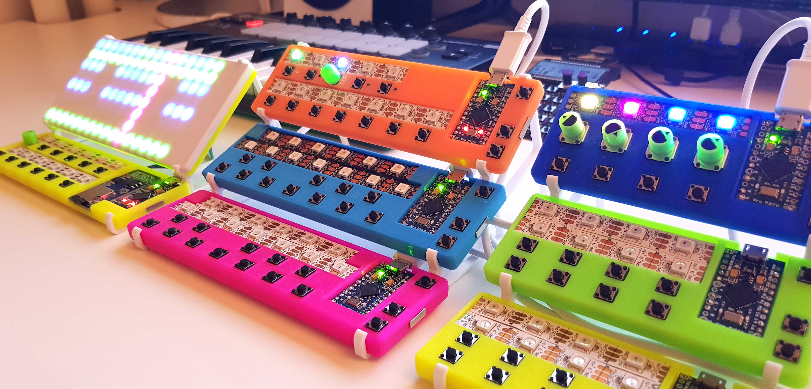

# LEET-Synthesizer
This is the GitHub repository containing the 3D models and source code for the LEET Synthesizer devices: https://vonkonow.com/wordpress/leet-synthesizer/

Description: LEET is a modular & affordable ($6) MIDI synth for your favorite DAW.

I have designed a keyboard, drum pad, chord keyboard, arpeggiator and a step sequencer all with RGB LEDs for playback visualization.
They are easy to build and anyone with a 3D printer and basic soldering skills should be able to replicate them. Everything is open source and hacking is encouraged!

Over the coming weeks I will document and publish each device. Please note that I do everything on my spare time, so bear with me if it takes a while ;)
I have created a forum where you can register and subscribe to get notices when I release the different devices: https://vonkonow.com/wordpress/forums/topic/project-updates/

For detailed building instructions visit: https://vonkonow.com/wordpress/leet-synthesizer/

